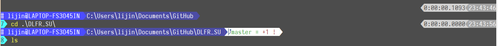

# **Powerline Style PowerShell Configure**

## **Introduction**
Use Powerline-like configuration on PowerShell, final effect looks like:  


## **Prerequisite**
- [Powerline Fonts](https://github.com/powerline/fonts) or [Inziu Fonts](https://be5invis.github.io/Iosevka/inziu.html)
- [posh-git](https://github.com/dahlbyk/posh-git) extension

## **Usage**
1. **New Configuration File**  
    There's no configuration file for PowerShell by default. User can use following command to create one:
    ```shell
    New-Item -type file -force $profile
    ```
    This command will create a directory "WindowsPowerShell" under "~\Documents\" and create a configuration file named "Microsoft.PowerShell_profile.ps1", which is actually a PowerShell script.  
       
2. **Change Execution Policy**  
    PowerShell's execution policy will restrict running a script by default. Use following command in PowerShell (Administrator Mode) to change it.
    ```shell
    Set-ExectionPolicy RemoteSigned
    ```

3. **Use This Configuration**
    Copy the script in this repository and substitute the one in "~\Documents\WindowsPowerShell". Restart PowerShell you will see the new theme.